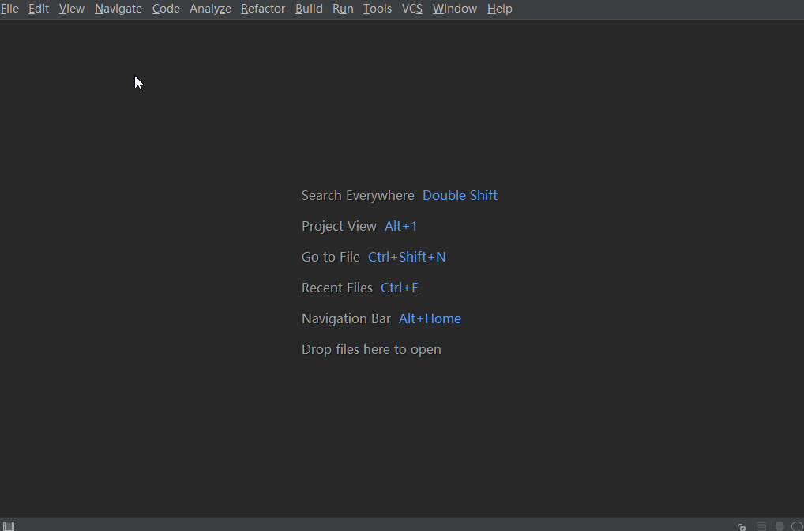

# NutzCodeInsight
### 1、在 Nutz Action Module 中点击 @Ok 前面的jsp图标即可快速打开或切换至已经打开的jsp文件
### 2、支持以HTML、JSP等格式文件作为页面模版得资源文件的快速定位
### 3、Navigate菜单中增加查找@At映射地址快捷方式 
### 4、Nutz web环境中支持折叠显示国际化配置文件变量值
#
idea插件仓库[https://plugins.jetbrains.com/plugin/10311-nutzcodeinsight](https://plugins.jetbrains.com/plugin/10311-nutzcodeinsight "真实项目")
####  完成
    - 支持自定义模版配置
#### 1 在 Nutz Action Module 中点击 @Ok 前面的jsp图标即可快速打开或切换至已经打开的jsp文件
```java
  //模式1  jsp模版（默认支持）
  @Ok("jsp:btl.demo.manager")
  //模式2  beetl模版 （默认支持）
  @Ok("btl:btl.demo.manager")
  @Ok("beetl:btl.demo.manager")
  //模式3 （适用于改造后得视图返回器，我自己使用的） 
  @Ok("btl:WEB-INF/btl/demo/manager.html")
```
#### 2 持以HTML、JSP等格式文件作为页面模版得资源文件的快速定位
```jsp
 <link rel="stylesheet" href="${base}/static/plugins/bootstrap/css/bootstrap.min.css?_=${productVersion}">
 <script src="${base}/static/plugins/jquery/jQuery-2.1.4.min.js"></script>
```
#### 4 持以HTML、JSP等格式文件作为页面模版得资源文件的快速定位(将光标移至 "login.sucess" 中任意位置 使用快捷键(展开：ctrl+ 收起：ctrl-))
```java
    MvcI18n.message("login.sucess");
    MvcI18n.messageOrDefault("login.sucess","登录成功");
    MvcI18n.messageOrDefaultFormat("login.sucess","{0}帐号登录{1}","test","失败");//test帐号登录失败
    Mvcs.getMessage(Mvcs.getReq(),"login.sucess");
```
### 添加自定义配置
 - File >> Settings >> NutzCodeInsight
 - File >> Settings >> Other Settings >> NutzCodeInsight

# 安装后效果



